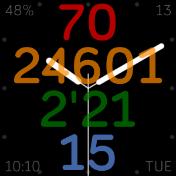

# Schmancy watchface for Fitbit Ionic/Versa

Features:
- Analog hands with seconds
- Big readout of the 4 main stats: Heart Rate/Step Count/Active Minutes/Floors Climbed
- Heart rate turns into resting heart rate when watch is off
- Pick an image from your phone's photo library to use as watch background
- Customize the transparency of the health stats, hour markers and date/battery indicator
- Direct link to app store (open with phone):
https://gam.fitbit.com/gallery/clock/62bce903-fbc8-43b4-a941-eeadd60fac6d
